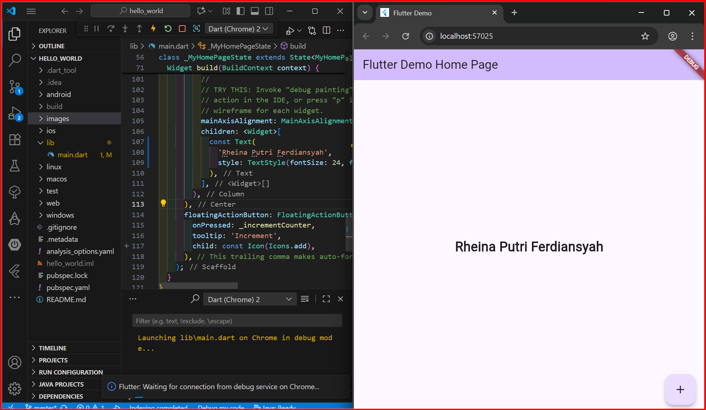
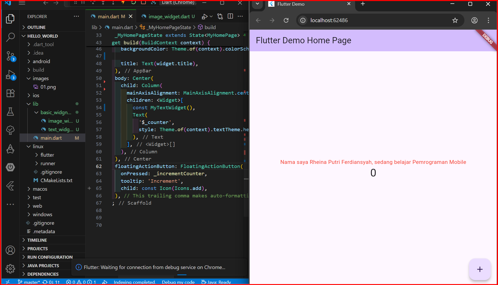
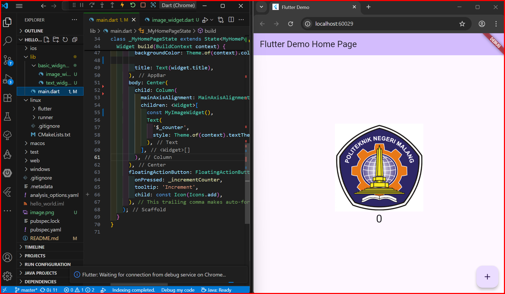
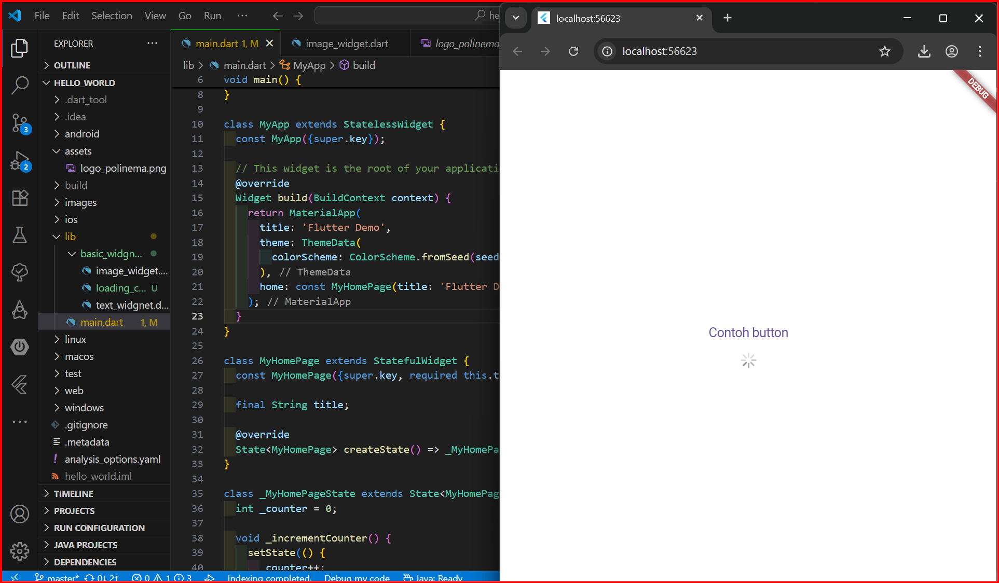
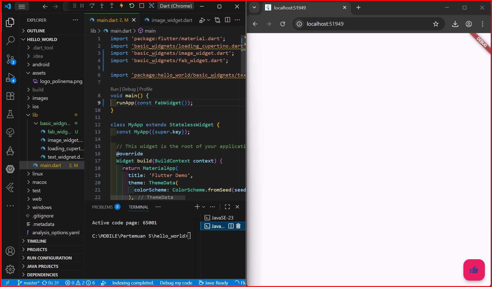
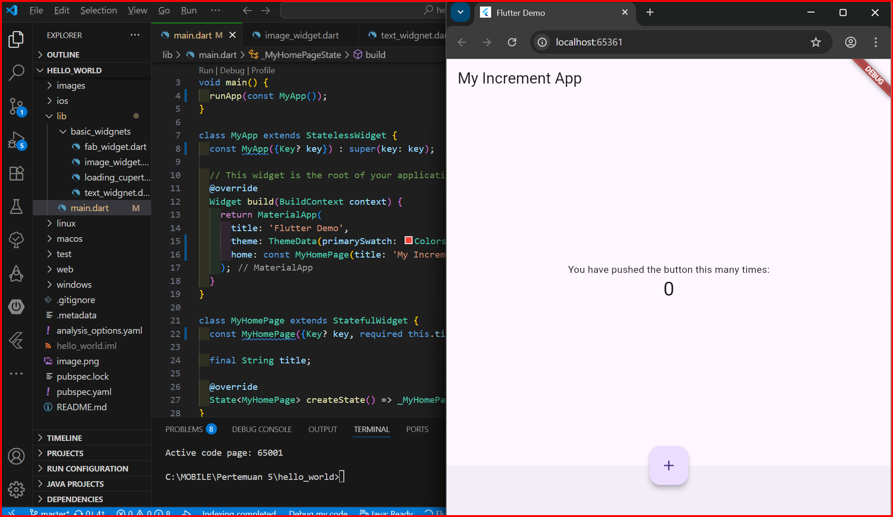
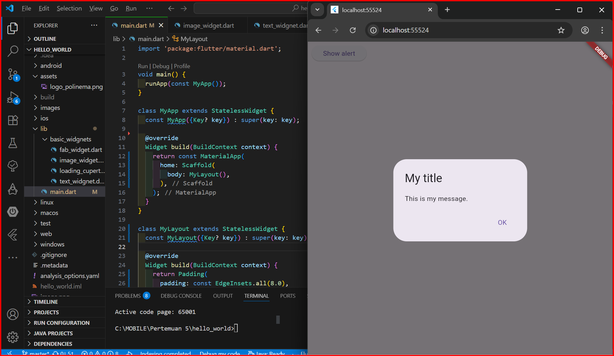
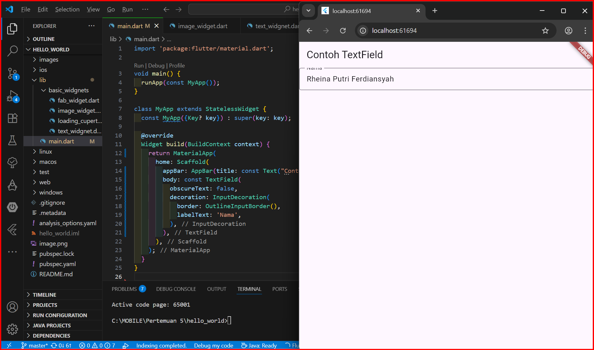

# hello_world

A new Flutter project.

Praktikum 4

Logo polinema

Praktikum 5 : Menerapkan Widget Material Design dan iOS Cupertino
Contoh Button

Langkah 2: Floating Action Button (FAB)

Langkah 3: Scaffold Widget

Langkah 4: Dialog Widget

Langkah 5: Input dan Selection Widget

