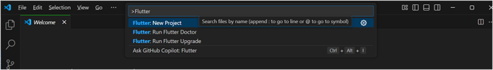
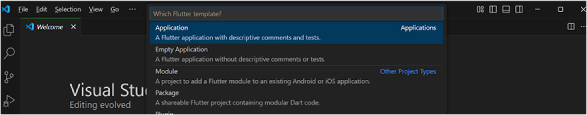
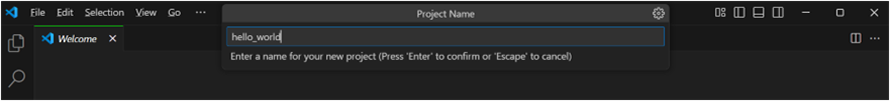
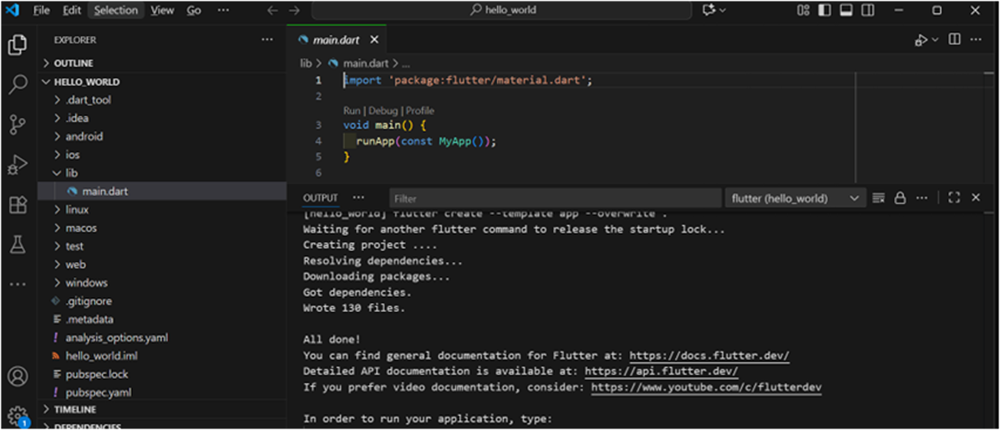
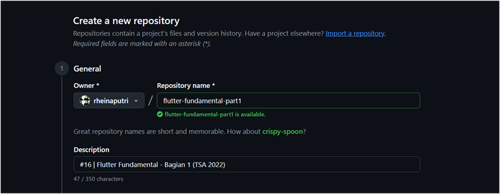
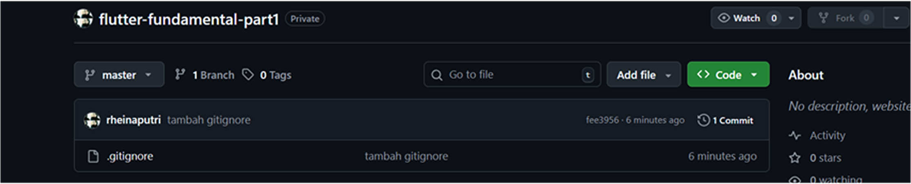
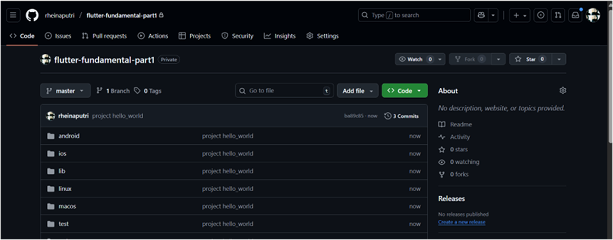
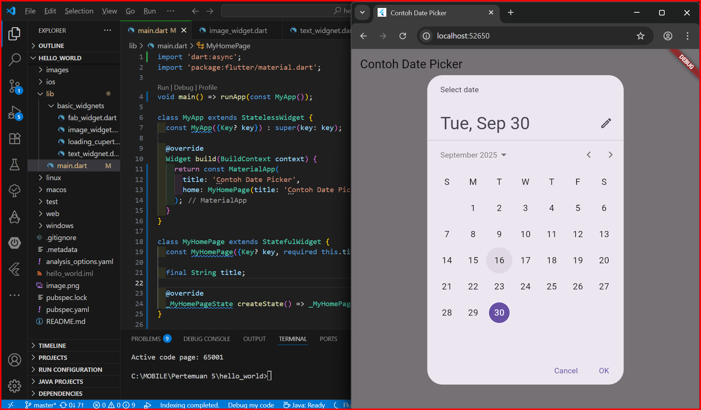

# hello_world

Nama : Rheina Putri Ferdiansyah
NIM  : 2341760084
 
***************** Praktikum 1 *****************

Membuat Flutter project baru

Buat nama project flutter hello_world 

***************** Praktikum 2 *****************

Menghubungkan Perangkat Android atau Emulator
-> Saya menggunakan chrome karena kendala menggunakan ios.

***************** Praktikum 3 *****************

Membuat Repository

Membuat gitignore, push ke github

Pilih Stage All Changes, commit dan push ke github

Kembali ke VSCode, running project hello world. lalu ubah menggunakan nama : Rheina Putri ferdiansyah.

***************** Praktikum 4 *****************
Menerapkan Widget Dasar
Buat folder baru basic_widgets di dalam folder lib. Kemudian buat file baru di dalam basic_widgets dengan nama text_widget.dart. Ketik atau salin kode program berikut ke project hello_world pada file text_widget.dart.

Image Widget : Logo_polinema. 
Buat sebuah file image_widget.dart di dalam folder basic_widgets dengan isi kode berikut.

***************** Praktikum 5 *****************
Praktikum 5 : Menerapkan Widget Material Design dan iOS Cupertino
Contoh Button

Langkah 1: Cupertino Button dan Loading Bar

Langkah 2: Floating Action Button (FAB)

Langkah 3: Scaffold Widget

Langkah 4: Dialog Widget

Langkah 5: Input dan Selection Widget

Langkah 6: Date and Time Pickers

